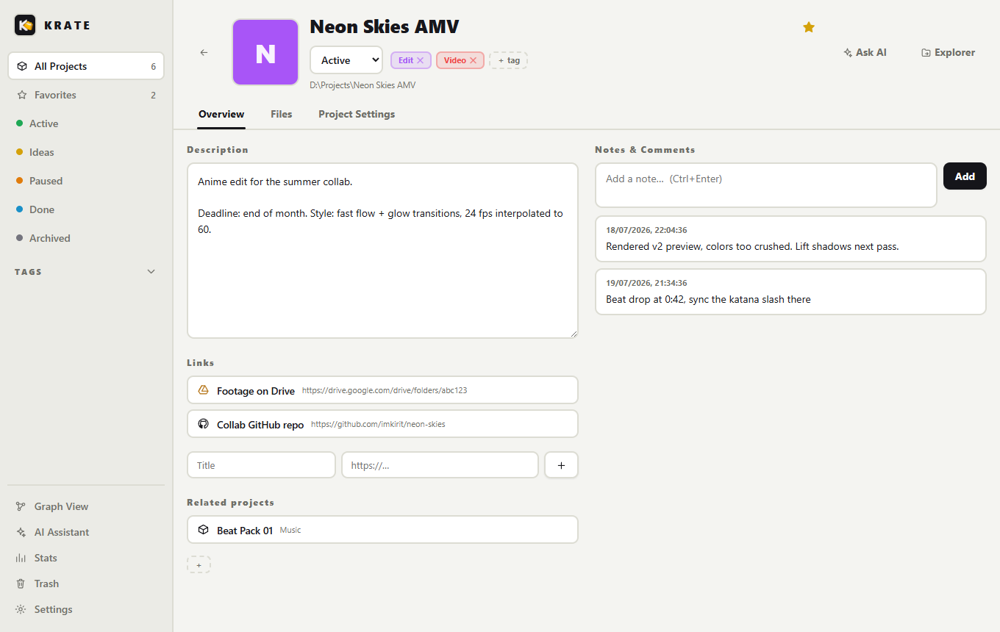
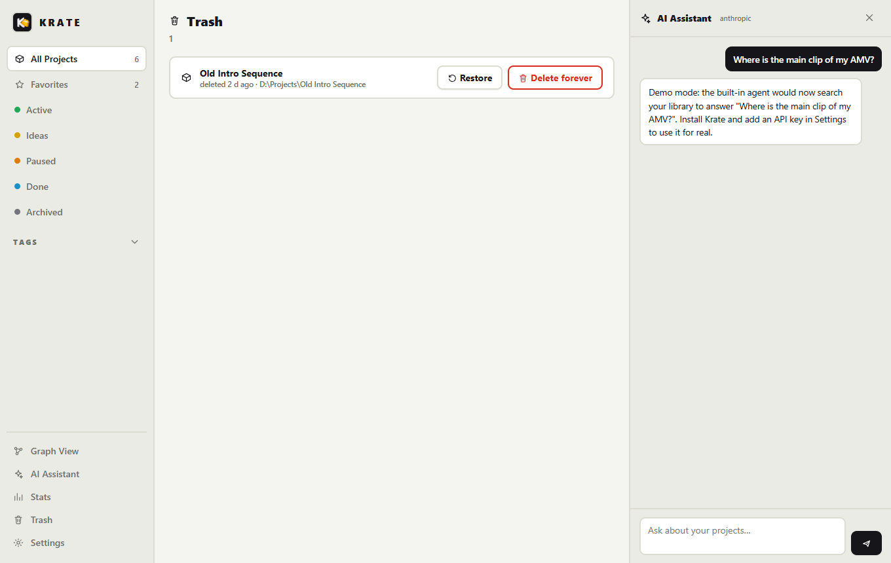
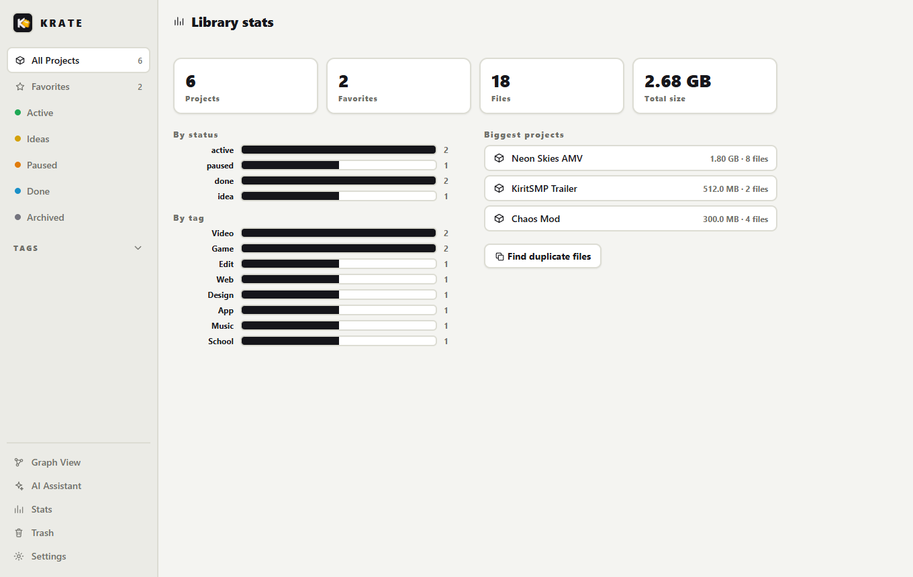
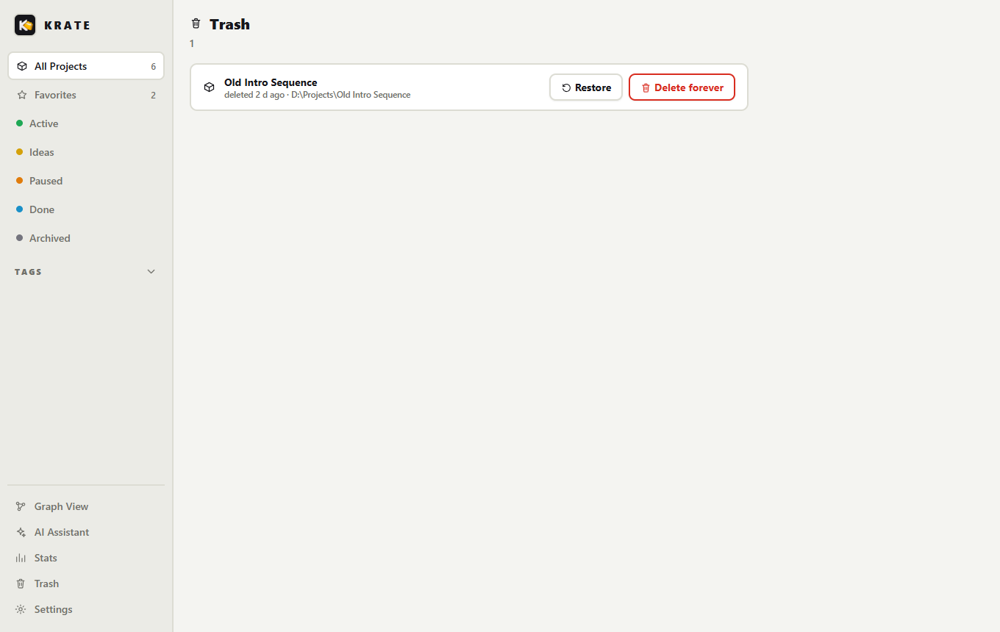
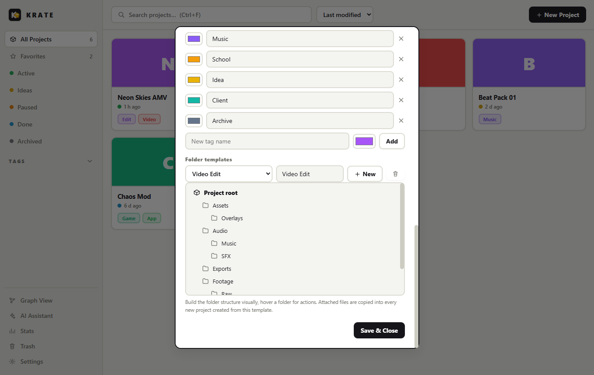

<div align="center">


# Krate

**Every project, packed and findable.**

A local-first project organizer for Windows. Tag your projects, template their
folder structure, nickname the files that matter, then pull any of them up from
anywhere with one hotkey. View your library as a graph, link your cloud drives,
and ask the built-in AI agent where things are.

[](https://github.com/ImKirit/Krate/releases/latest)
[](LICENSE)
[](https://imkirit.dev/krate)


</div>

---

## Why?

Started as a tool for organizing video edits: footage, SFX, project files and
renders scattered everywhere, never findable when needed. Krate grew into a
general project organizer. **Every project is a normal folder on your disk**,
plus a small `krate.json` that stores its metadata. No database, no cloud, no
lock-in. Uninstall Krate and your files are exactly where they always were.

## Up and running in 5 steps

1. **Install** the [latest release](https://github.com/ImKirit/Krate/releases/latest) and launch it. A short setup wizard asks for your projects folder and can adopt the folders already inside it as projects.
2. **Create a project** with the New Project button. Pick a template like "Video Edit" and the folder structure (plus any starter files) is created for you.
3. **Nickname your key files** in the Files tab: right side of any row, pencil icon. "main clip" beats `render_v7_FINAL2.mp4`.
4. **Press `Ctrl+Alt+K` anywhere in Windows.** Type a name or nickname, hit Enter to open, or drag the result straight into Premiere, Discord or a browser.
5. **Optional:** add an AI key in Settings and ask things like "where is the render of my last edit?" The agent searches your actual library before it answers.

## Features

### Organize

- **Projects as folders.** One default projects folder, or any custom location per project. Existing folders can be adopted with one click.
- **Tags and statuses.** Preset tags (Edit, Video, App, Web, ...) plus custom tags with custom colors. Filter by tag or by Idea / Active / Paused / Done / Archived.
- **Folder templates.** Build structures in a visual tree editor and attach starter files that are copied into every new project. Any existing project's layout can be saved as a template.
- **Favorites.** Pinned projects float to the top of the grid and get their own filter.
- **Cloud links and relations.** Attach Google Drive folders, Dropbox shares or repos to a project, and link projects to each other.

### Find

- **Global quick search.** One hotkey (default `Ctrl+Alt+K`) anywhere in Windows. Searches projects, files, nicknames and links at once, with fuzzy matching. Results can be dragged into any app.
- **File nicknames.** Searchable names for the files that matter, shown as badges everywhere.
- **Graph view.** The whole library as an interactive map: projects, tags, folders, files and links. Related projects are connected with dashed edges.
- **Built-in AI agent.** Lives in a side panel and in the quick search bar. It lists, searches and reads your projects with real tools before answering. Works with a Claude or Groq API key, or embed Claude, ChatGPT, Gemini or Copilot and sign in with your account.
- **Stats and duplicates.** Projects per status and tag, sizes, biggest projects, plus a duplicate finder for identical files across the library.

### Automate and more

- **Watch folder.** Krate can watch your Downloads folder and offer to sort new files into a project.
- **Drag and drop, both ways.** Drop files onto Krate to import them, drag search results out into other apps.
- **Trash and ZIP export.** Deleted projects land in a restorable trash. Any project exports as a ZIP with its metadata included.
- **Autostart.** Starts with Windows in the background (tray plus hotkey), so quick search is always one keypress away. Toggle in Settings.
- **Portable mode and krate:// links.** Run from a USB stick (`krate-portable.txt` next to the exe), and open projects from anywhere with `krate://project-name` links.
- **Three themes.** Light (white with black accents, the default), Dark, and the classic Krate Purple, plus a free accent color. Animations are switchable too.

## Screens

| | |
|---|---|
| **Project overview** with description, notes, cloud links and related projects | **Files tab** with nickname badges, custom file-type icons and drag and drop |
|  |  |
| **Graph view**: the full structure of every project as one map | **AI panel**: an agent with real tools over your library |
|  |  |
| **Stats** with sizes, status and tag breakdowns | **Trash**: deleted projects are restorable |
|  |  |
| **Settings** with the visual template editor | **Quick search** finding a file by its nickname |
|  |  |

## Quick search keys

| Key | Action |
| --- | --- |
| `Ctrl+Alt+K` | Open / close (configurable in Settings) |
| `↑` `↓` | Select result |
| `Enter` | Open file / enter folder |
| `Ctrl+Enter` | Show in Explorer |
| `Shift+Enter` | Open in the Krate window |
| `Tab` | Toggle search / browse mode |
| `Ctrl+Space` | AI mode |
| `←` / `Backspace` | Up one folder (browse mode) |
| Drag a row | Drop the file anywhere |
| `Esc` | Close |

## AI setup

Settings → AI assistant. Two modes:

- **Built-in agent (recommended).** Paste an API key from [Anthropic](https://console.anthropic.com) (Claude) or [Groq](https://console.groq.com) (free tier available). The **Test button** checks the connection immediately and shows the exact provider error if something is wrong. Note: a claude.ai subscription is not an API key; the API needs its own account with credits.
- **Web mode.** Embeds Claude, ChatGPT, Gemini or Copilot inside the panel. Sign in once with your account; "Ask AI" on a project copies its full context to paste into the chat.

Keys are stored locally in `config.json` and never leave your machine except to the provider you chose.

## How data is stored

```
MyProject/
├─ krate.json        title, tags, notes, links, nicknames, status
├─ .krate/           cover image
└─ your files, exactly as you put them
```

Global settings live in `%APPDATA%/krate/config.json`, template starter files
in `%APPDATA%/krate/template-files/`, the trash in `%APPDATA%/krate/trash/`.
In portable mode all of it moves to a `data` folder next to the exe.

## Install

Grab the installer from **[Releases](https://github.com/ImKirit/Krate/releases/latest)**, or build from source:

```bash
git clone https://github.com/ImKirit/Krate.git
cd Krate
npm install
npm start
```

## Development

```bash
npm start          # run the app
npm run smoke      # headless startup check (uses a throwaway profile)
npm run dist       # build the NSIS installer into dist/
node scripts/screenshot.js   # re-render the README screenshots (via npx electron)
```

Plain Electron with a single runtime dependency (the Anthropic SDK for the AI
agent). `src/main` is the main process (store, search indexer, AI agent,
windows, IPC), `src/renderer` the main window, `src/overlay` the quick search.

## License

[MIT](LICENSE) © ImKirit
